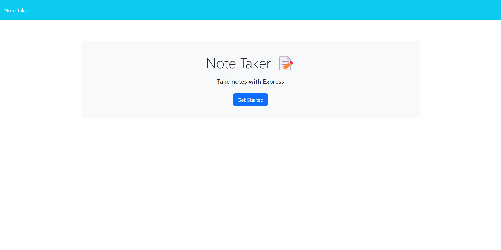
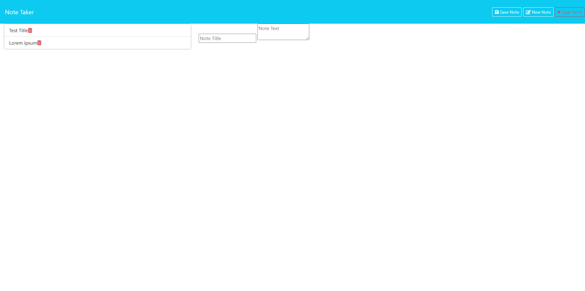

# Note-Taker

## Description
When you open the Note Taker app you are presented with a landing page with a link to a notes page. When you click the link, you are presented with a page with existing notes listed in the left-hand column with empty fields to enter a new note title and the note's text in the right-hand column. When you enter a new note title and text a "Save Note" button and "Clear Form" button appear in the navigation at the top of the page. When you click on "Save Note" the new note is saved and appears in the left-hand column and the text in the note title and text is cleared. When you click on an existing note in the left-hand column, the note appears in the right-hand column and a "New Note" button appears in the navigation. When you click on the "New Note" button in the navigation, you are shown empty fields to enter a new note title and text and the button dissapears. If you click the red trashcan icon next to a note in the left-hand column it will delete the note.

## Visuals
The following image shows the web application's appearance. You can also go to the web application by clicking the following link. https://my-note-taker-using-express-61de9021496f.herokuapp.com/

## Installation
Clone the project. Type in the following commands into your terminal:
- npm install
- npm start

You should now be able to run your app through Insomnia or another similar app.

## Authors and acknowledgment
- Chelle Wood: student at edx Coding Bootcamp
- Express.js: back end web app framework building
- Bootstrap: sylizing
- uniqid npm: to create a unique id for all note html
- Heroku: cloud platform service to run the app
- Xpert Learning Assistant: general troubleshooting, bug fixing, and general understanding of each line of code
- Starter code: provided by https://github.com/coding-boot-camp/miniature-eureka

## License
Refer to MIT license on Repo
